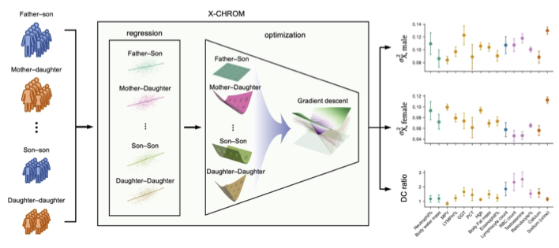

# X-CHROM
<p align="center">
</p>
<!-- {: width="100%" height="100%"} -->

## Introduction

X-CHROM is a model that estimates X chromosome heritability and dosage compensation ratio 
from familial relationships and their phenotypes. This model does not require genotype information 
and uses only phenotype and familial relationship data as input.

## Software requirements

### OS Requirements

The package has been tested on the following systems:

- macOS: Ventura v.13.0.1
- Linux: CentOS v.7


### Python Dependencies

The package has been tested with the following versions of dependencies:

```
numpy (v.1.22.3)
scipy (v.1.7.3)
pandas (v.1.5.1)
```

## Installation Guide:

The installation process takes a few seconds, including downloading test data.

```
git clone https://github.com/jerrylee9310/xchrom
cd xchrom
```

## Usage

X-CHROM requires two types of input:

1. Phenotype data, which consists of three columns (ID, ID, phenotype). Check the example format in `./test_data/simul.phen`.
2. Relationship information data, which consists of two columns (ID1, ID2) representing pairs of individuals with specific familial relationships. Check the example format in `./test_data/{relationship}.relationship`.

X-CHROM can be run using the following Python code:

```python
import src.xchrom.XCHROM as XCHROM

# input files
pheno_fn = "../test_data/simul.phen"
rel_fn = { # key is the relationship, value is the path of the relationship file
    'father_son': '../test_data/father_son.relation',
    'mother_daughter': '../test_data/mother_daughter.relation',
    'son_son': '../test_data/son_son.relation',
    'daughter_daughter': '../test_data/daughter_daughter.relation'
    }
 
# run X-CHROM
MODEL = XCHROM.XCHROM()
res_optim, res_frreg = MODEL.estimate_x(rel_fn, pheno_fn, num_boots=1000)
```

The results of X-CHROM consist of four variance components (a, xMale, xFemale, mPO). The mean and standard error of the estimates can be checked using the following command in Python:

```python
res_optim.agg(["mean", "std"])
```

A detailed description of how the simulation data is generated and how to run X-CHROM using phenotype and relationship information data can be found in ./notebook/simulation.ipynb. This file contains the following:

1. Familial phenotype simulation process
2. Estimating the X chromosome heritability (X-CHROM)


## Miscellaneous

For a better understanding of dosage compensation (DC), check `./notebook/dcSimulation.ipynb`. In this notebook, we describe why the variance explained by the X chromosome is half in females in the context of full dosage compensation.

## License
The X-CHROM Software is freely available for non-commercial academic research use. For other usage, one must contact Buhm Han (BH) at buhm.han@snu.ac.kr (patent pending). WE (Jaeeun Lee and BH) MAKE NO REPRESENTATIONS OR WARRANTIES WHATSOEVER, EITHER EXPRESS OR IMPLIED, WITH RESPECT TO THE CODE PROVIDED HERE UNDER. IMPLIED WARRANTIES OF MERCHANTABILITY OR FITNESS FOR A PARTICULAR PURPOSE WITH RESPECT TO CODE ARE EXPRESSLY DISCLAIMED. THE CODE IS FURNISHED "AS IS" AND "WITH ALL FAULTS" AND DOWNLOADING OR USING THE CODE IS UNDERTAKEN AT YOUR OWN RISK. TO THE FULLEST EXTENT ALLOWED BY APPLICABLE LAW, IN NO EVENT SHALL WE BE LIABLE, WHETHER IN CONTRACT, TORT, WARRANTY, OR UNDER ANY STATUTE OR ON ANY OTHER BASIS FOR SPECIAL, INCIDENTAL, INDIRECT, PUNITIVE, MULTIPLE OR CONSEQUENTIAL DAMAGES SUSTAINED BY YOU OR ANY OTHER PERSON OR ENTITY ON ACCOUNT OF USE OR POSSESSION OF THE CODE, WHETHER OR NOT FORESEEABLE AND WHETHER OR NOT WE HAVE BEEN ADVISED OF THE POSSIBILITY OF SUCH DAMAGES, INCLUDING WITHOUT LIMITATION DAMAGES ARISING FROM OR RELATED TO LOSS OF USE, LOSS OF DATA, DOWNTIME, OR FOR LOSS OF REVENUE, PROFITS, GOODWILL, BUSINESS OR OTHER FINANCIAL LOSS.

## Reference
Genotype-Free Estimation of Sex Chromosome Heritability and Dosage Compensation, _under review_.